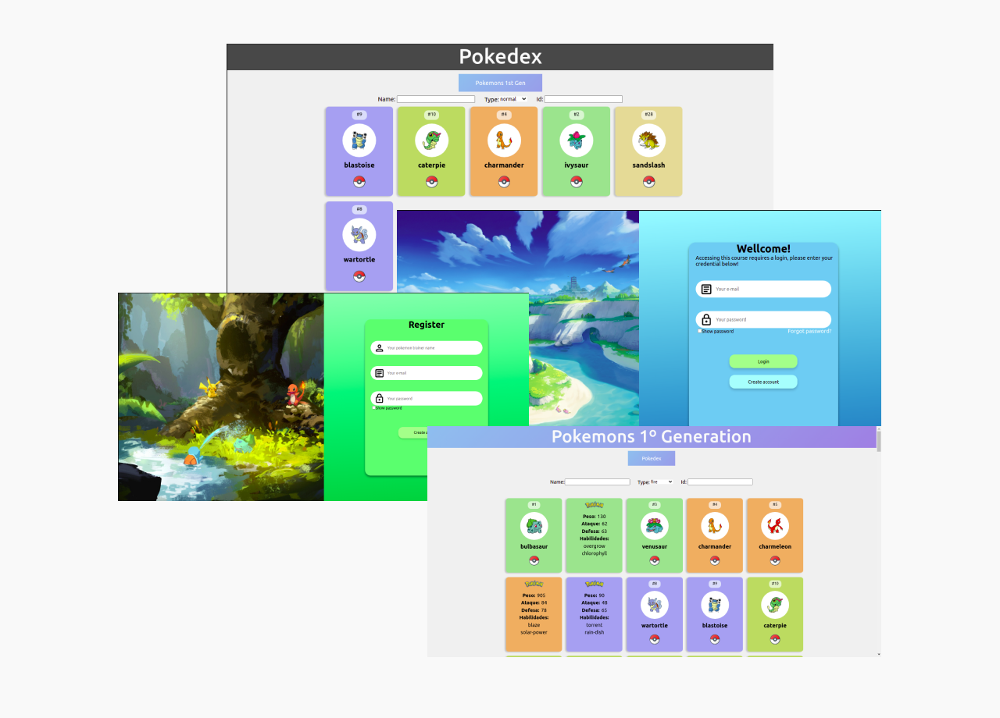

<h1 align="center">
	
</h1>

<h3 align="center">
  Pokeholocron
</h3>

<p align="center">
  
  
  
  
  <a href="https://github.com/BrunoSSantana/pokeholocron/commits/master">
    
  </a>
  
  <a href="https://github.com/BrunoSSantana/pokeholocron/issues">
    
  </a>
  
  
</p>

<p align="center">
  <a href="#-about-the-project">About the project</a>&nbsp;&nbsp;&nbsp;|&nbsp;&nbsp;&nbsp;
  <a href="#-technologies">Technologies</a>&nbsp;&nbsp;&nbsp;|&nbsp;&nbsp;&nbsp;
  <a href="#-getting-started">Getting started</a>&nbsp;&nbsp;&nbsp;|&nbsp;&nbsp;&nbsp;
  <a href="#-how-to-contribute">How to contribute</a>&nbsp;&nbsp;&nbsp;|&nbsp;&nbsp;&nbsp;
  <a href="#-license">License</a>
</p>



## 👨🏻‍💻 About the project

This application was developed during the first week of community challenges [Holocron](https://www.instagram.com/somosholocron/).

This challenge created by Felipe Pereira and Gabriel Sartorato with the following description:

*With the API(PokeAPI), we need you to create a WEB interface to display the information of the captured Pokemons using ReactJs. Create the back using nodejs(adonis, express, nestjs etc) and postgres* 

**Application Requirements**

1. Create account for coach
2. Add new Pokémon to Pokédex which at first will be empty (save in postgres)
    1. save (name, types, image url, weight, size, attack and defense, abilities)
3. Have a filter to search Pokemons by name, number or type
4. List the Pokémon that have been added to Pokédex in alphabetical order
5. List all 1st generation pokemons (only)
6. Show character details added to Pokédex as:
    - Name
    - Image giving the user the option to upload their own image, replacing the one delivered via API
    - Weight
    - List of types
    - List of skills
    - Defense
    - Attack
7. Delete Pokémon that have been added to Pokédex 


## 🚀 Technologies

Technologies that we used to develop this api

- [Node.js](https://nodejs.org/en/)
- [Express](https://expressjs.com/pt-br/)
- [TypeScript](https://www.typescriptlang.org/)
- [TypeORM](https://typeorm.io/#/)
- [PostgreSQL](https://www.postgresql.org/)
- [Nodemon](https://nodemon.io/)
- [ReactJS](https://reactjs.org/)
- [Eslint](https://eslint.org/)
- [React Router DOM](https://reacttraining.com/react-router/)
- [Axios](https://github.com/axios/axios)

## 💻 Getting started

Import the `Insomnia.json` on Insomnia App or click here [](https://insomnia.rest/run/?label=PokeHolocron&uri=https%3A%2F%2Fraw.githubusercontent.com%2FBrunoSSantana%2Fpokeholocron%2Ffeature%2FAddPokemons%2Fdoc%2Fdoc_pokeholocron.json) 

### Requirements

- [Node.js](https://nodejs.org/en/)
- [Yarn](https://classic.yarnpkg.com/) or [npm](https://www.npmjs.com/)
- One instance of [PostgreSQL](https://www.postgresql.org/)

**Clone the project and access the folder**

```bash
$ git clone https://github.com/EliasGcf/NOME_DO_REPO.git && cd NOME_DO_REPO
```

**Follow the steps below**

### Backend

```bash
# Starting from the project root folder, go to backend folder
$ cd backend

# Install the dependencies
$ yarn

# Create the instance of postgreSQL using docker
$ docker run --name project-postgres -e POSTGRES_PASSWORD=docker -p 5432:5432 -d postgres

# Make sure the keys in 'ormconfig.json' to connect with your database
# are set up correctly.

# Once the services are running, run the migrations
$ yarn typeorm migration:run

# To finish, run the api service
$ yarn dev:server

# Well done, project is started!
```

### Web

_Obs.: Before to continue, be sure to have the API running_

```bash
# Starting from the project root folder, go to frontend folder
$ cd frontend

# Install the dependencies
$ yarn

# Be sure the file 'src/services/api.ts' have the IP to your API

# Start the client
$ yarn start
```


## 🤔 How to contribute

**Make a fork of this repository**

```bash
# Fork using GitHub official command line
# If you don't have the GitHub CLI, use the web site to do that.

$ gh repo fork BrunoSSantana/pokeholocron
```

**Follow the steps below**

```bash
# Clone your fork
$ git clone your-fork-url && cd pokeholocron

# Create a branch with your feature
$ git checkout -b my-feature

# Make the commit with your changes
$ git commit -m 'feat: My new feature'

# Send the code to your remote branch
$ git push origin my-feature
```

After your pull request is merged, you can delete your branch

## 📝 License

This project is licensed under the MIT License - see the [LICENSE](LICENSE) file for details.

---
## 👨‍💻 Contribuidores

All the success we achieve is the result of teamwork. It was an honor to have this opportunity to work with these great professionals and to be bringing valuable knowledge of this experience. And a special thanks to the [Holocron community](https://www.instagram.com/somosholocron/) 💜.

<table>
  <tr>
    <td align="center"><a href="https://github.com/BrunoSSantana"><br /><sub><b>Bruno Santana</b></sub></a><br /><a href="https://github.com/BrunoSSantana/" title="Bruno Santana"></a></td>
    <td align="center"><a href="https://github.com/DouglasANS/"><br /><sub><b>DouglasANS
</b></sub></a><br /><a href="https://github.com/DouglasANS/" title="Douglas Agostinho"></a></td>
    <td align="center"><a href="https://github.com/MoizesFSantos"><br /><sub><b>	Moizes F. dos Santos</b></sub></a><br /><a href="https://github.com/MoizesFSantos" title="MoizesFSantos"></a></td>
    <td align="center"><a href="https://github.com/Jefferson00/"><br /><sub><b>
Jefferson C. Silva</b></sub></a><br /><a href="https://github.com/Jefferson00/" title="Jefferson00"></a></td>
    
  </tr>
</table>


